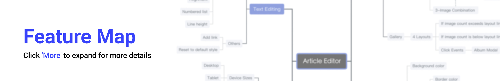
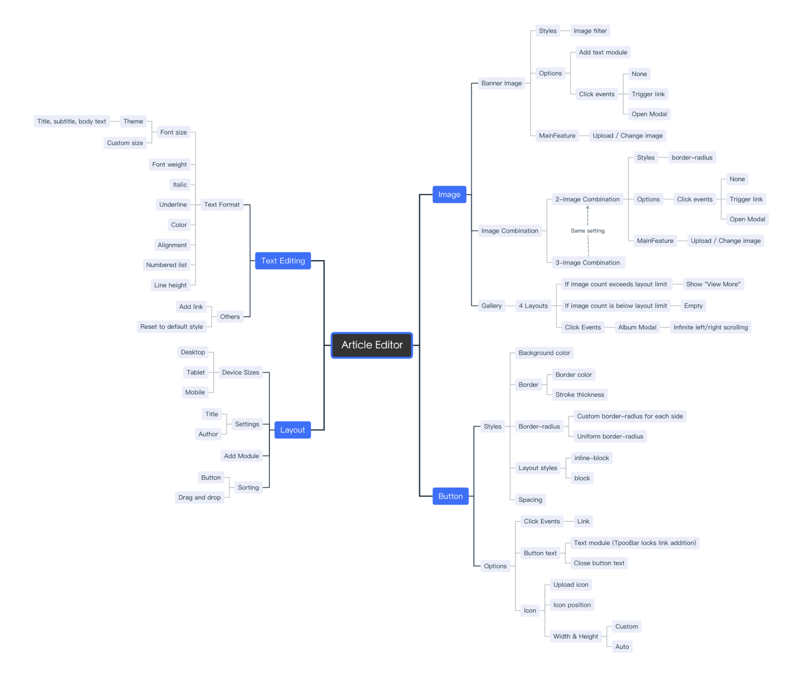
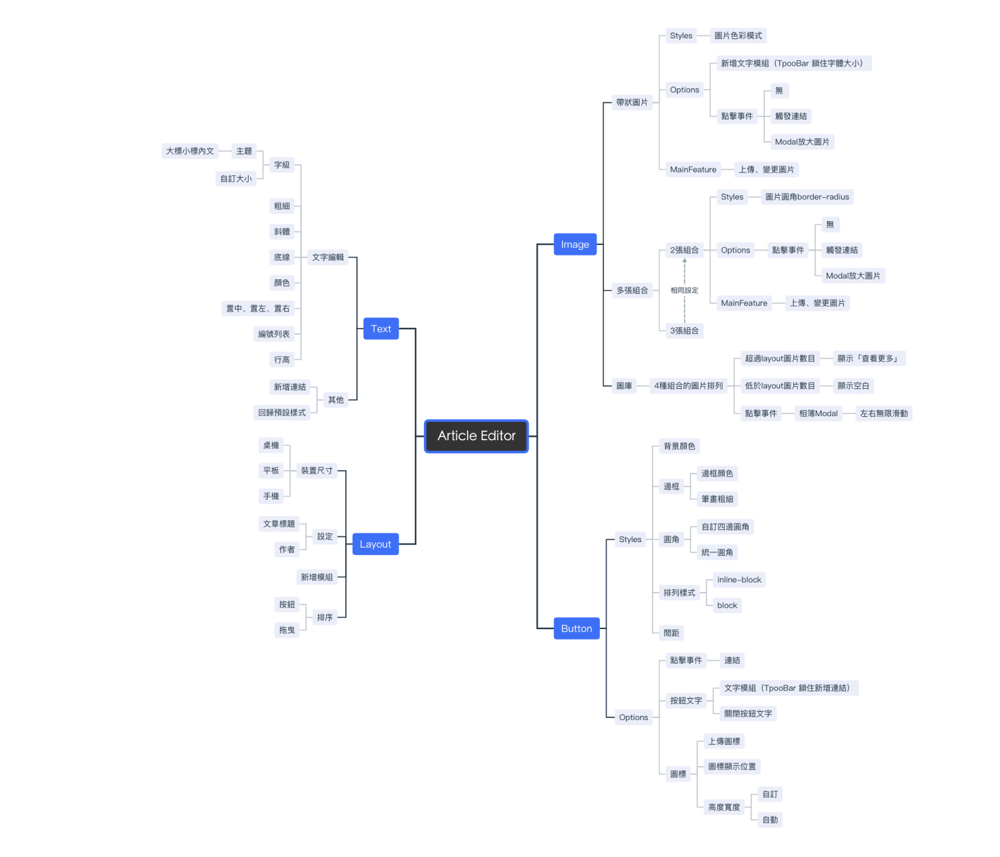
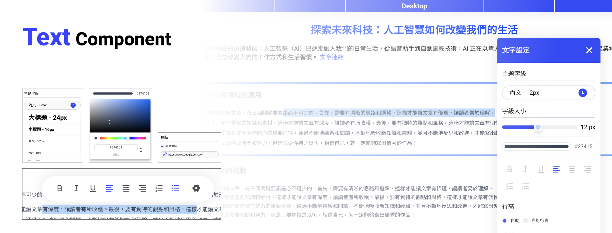
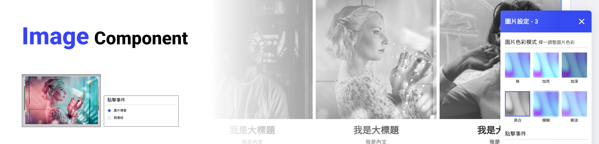
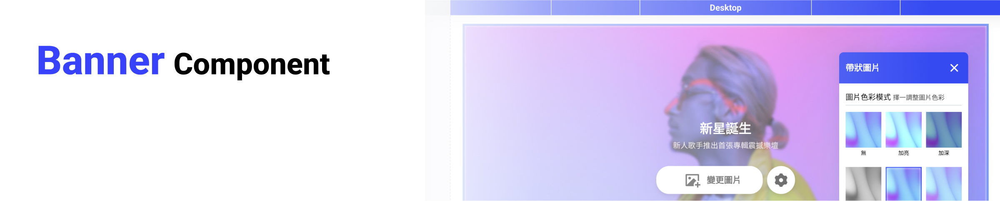
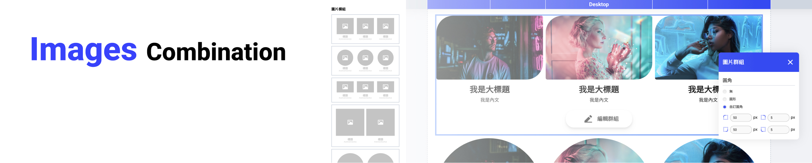
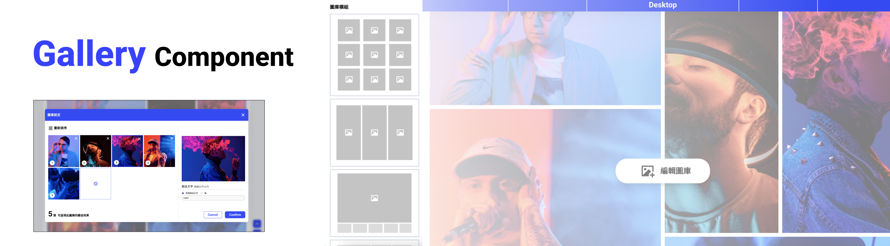
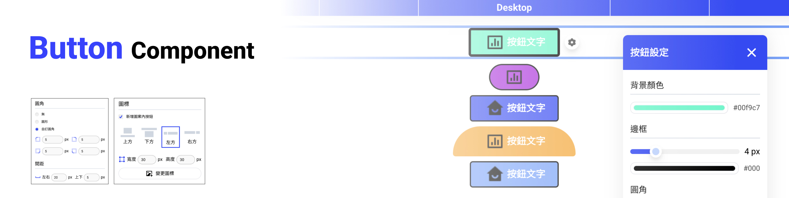
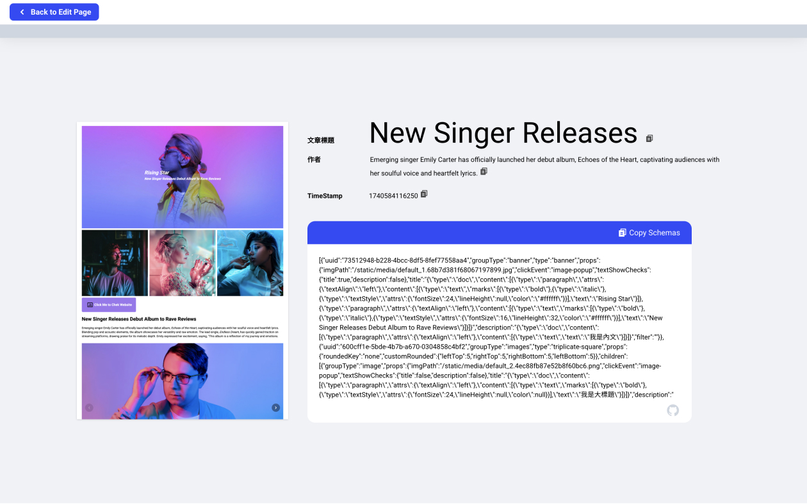

# WEB Article Editor


A reusable article editor in order to making a visual builder system, supporting ``Desktop``, ``Tablet``, and ``Mobile`` with a unified Schema for flexible editing and display. 💙 

Inspired by the article 
[Visual Building Systems by jkopay](https://medium.com/jkopay-frontend/%E8%A1%97%E5%8F%A3%E5%89%8D%E7%AB%AF%E8%A6%96%E8%A6%BA%E6%90%AD%E5%BB%BA%E7%B3%BB%E7%B5%B1-%E5%89%B5%E5%A7%8B%E7%AF%87-e849f713fbe0) ✨


## Key Features
- Rich text editing with [Tiptap](https://tiptap.dev/)
- Reusable content components
- Two modes: \
**Edit Mode**: Modify content in real time \
**View Mode**: Display content on any webpage

## Features Structure


<details>
  <summary>More in English Map </summary>
  
</details>

<details>
  <summary>More in Mandarin Map </summary>
   
</details>


## Component Features

### Text

- Quick editing via toolbar or detailed customization.
- **Styles:** 
`` Font weight, Italic, Underline, Color, Alignment, Numbered list, Line height. ``
- Add links.
- Reset to default style.

### Image

- **Image Filters:** Six filter options available.
- **Click Events:** Open a link or modal.

### Banner Image

- **Add Text Module:** Option to include a title and body text.

### Image Combination

- **Combination:** Supports 2-image or 3-image layouts.
- **Border-radius:** Adjusts for the entire group.

### Gallery

- **Layout:** Four different gallery styles.
- **Carousel Modal:** Opens a carousel when clicked.

### Button

- Editable button text and customizable icons.
- **Styling:** ``Background color, Border, Border-radius, Layout styles, Spacing.``
- **Click Events:** Supports linking.

## Publish! ✍️

Get your Article Schema and Snapshot.

## Key Interfaces
#### Schema
Each component has its own schema settings, including:
- groupTypes
- type
- controls (only for Editor Mode)
- controlProps (stores data for control settings)

``` typescript
type ISingleSchema = IBanner | IGallery | IButton | IParagraph
type IMultipleSchema = IImages
type IComponentSchema = ISingleSchema | IMultipleSchema

interface IBanner {
  uuid: string
  groupType: groupTypeEnum.banner
  type: bannerType
  props?: IControlProps
}
```

#### Component
Each Container includes different components. In Editor Mode, components are wrapped in ``FocusElement`` to enable selection and drag-and-drop features.

``` typescript
switch (schema.groupType) {
    case groupTypeEnum.banner:
      return <BannerComponent {...props} schema={schema} />
    case groupTypeEnum.images:
      return <ImagesComponent {...props} schema={schema} />
    // ... other components
}
```

#### Controller
Displays different controls in ``ControllerContainer`` based on the selected component. Allows editing of appearance and settings.

``` typescript
  switch (control) {
    case 'imgPathControl':
      return <ImgPathControl {...controlProps} />
    case 'imgFilterControl':
      return <ImgFilterControl {...controlProps} />
    case 'clickEventControl':
      return <ClickEventControl {...controlProps} />
    // ... other controls
}
```

## Server
Practice integrating services to the server, including:
- Uploading articles to MongoDB.
- Uploading images to AWS.

This project connects to the [Node_Article_Editor_Server](https://github.com/YUNI0107/Node_Article_Editor_Server).

``` 
REACT_APP_SERVER_URL=
REACT_APP_WITH_SERVER_FEATURE=
```